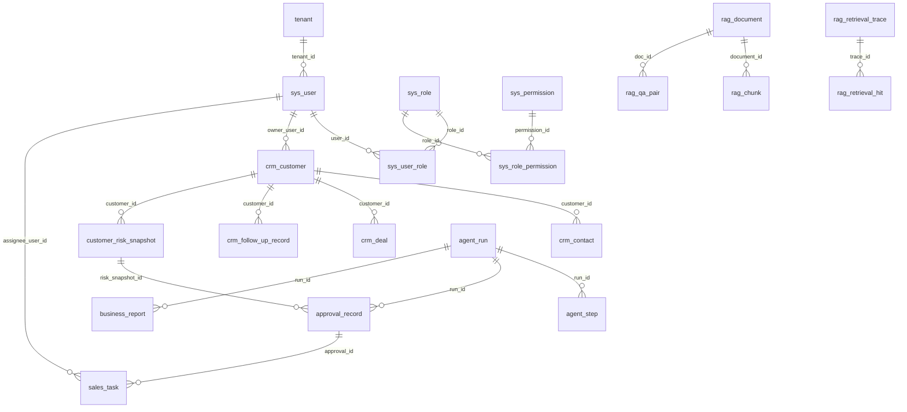

# InsightPilot V1 完整 ER 设计

版本：v1.0

设计原则：

- V1 使用单体 FastAPI 模块化项目，数据库使用 MySQL。
- V1 只做伪多租户，所有核心业务表预留 `tenant_id`，默认值使用 `demo_tenant`。
- 不使用数据库外键约束，表之间通过同名字段进行隐性关联。
- 所有关联字段必须建立普通索引，保证查询性能。
- Agent 不直接落地危险动作，必须先写入审批表，人工确认后再创建正式任务。

## 一、核心实体关系



说明：上图表达业务关系，真实 MySQL 建表时不创建外键约束。

## 二、租户与权限模块

### 1. tenant

用途：预留 SaaS 多租户能力。V1 只初始化一个 `demo_tenant`。

| 字段 | 类型 | 说明 |
|---|---|---|
| id | bigint | 自增主键 |
| tenant_id | varchar(64) | 租户业务 ID，唯一 |
| tenant_name | varchar(100) | 租户名称 |
| status | tinyint | 1 启用，0 禁用 |
| created_at | datetime | 创建时间 |
| updated_at | datetime | 更新时间 |

索引：

- `uk_tenant_id(tenant_id)`

### 2. sys_user

用途：系统用户，V1 包含老板、销售主管、销售员。

| 字段 | 类型 | 说明 |
|---|---|---|
| id | bigint | 自增主键 |
| tenant_id | varchar(64) | 租户 ID |
| user_id | varchar(64) | 用户业务 ID，建议如 `u_owner_001` |
| username | varchar(64) | 登录账号 |
| password_hash | varchar(255) | 密码哈希 |
| real_name | varchar(80) | 真实姓名 |
| phone | varchar(30) | 手机号 |
| email | varchar(120) | 邮箱 |
| status | tinyint | 1 启用，0 禁用 |
| is_deleted | tinyint | 软删除 |
| last_login_at | datetime | 最后登录时间 |
| created_at | datetime | 创建时间 |
| updated_at | datetime | 更新时间 |

索引：

- `uk_tenant_username(tenant_id, username)`
- `uk_user_id(user_id)`
- `idx_tenant_status(tenant_id, status)`

### 3. sys_role

用途：角色表。V1 内置 `owner`、`manager`、`salesperson`。

| 字段 | 类型 | 说明 |
|---|---|---|
| id | bigint | 自增主键 |
| tenant_id | varchar(64) | 租户 ID |
| role_id | varchar(64) | 角色业务 ID |
| role_code | varchar(50) | 角色编码 |
| role_name | varchar(80) | 角色名称 |
| status | tinyint | 1 启用，0 禁用 |
| remark | varchar(255) | 备注 |
| created_at | datetime | 创建时间 |
| updated_at | datetime | 更新时间 |

索引：

- `uk_tenant_role_code(tenant_id, role_code)`
- `uk_role_id(role_id)`

### 4. sys_permission

用途：权限点表，控制接口和 Agent Tool 调用。

| 字段 | 类型 | 说明 |
|---|---|---|
| id | bigint | 自增主键 |
| permission_id | varchar(64) | 权限业务 ID |
| permission_code | varchar(100) | 权限编码，如 `crm:risk:read:team` |
| permission_name | varchar(100) | 权限名称 |
| module | varchar(50) | 模块 |
| action | varchar(50) | 动作 |
| description | varchar(255) | 描述 |
| status | tinyint | 1 启用，0 禁用 |
| created_at | datetime | 创建时间 |
| updated_at | datetime | 更新时间 |

索引：

- `uk_permission_code(permission_code)`
- `idx_permission_module(module)`

### 5. sys_user_role

用途：用户角色关系表。

| 字段 | 类型 | 说明 |
|---|---|---|
| id | bigint | 自增主键 |
| tenant_id | varchar(64) | 租户 ID |
| user_id | varchar(64) | 用户业务 ID |
| role_id | varchar(64) | 角色业务 ID |
| created_at | datetime | 创建时间 |

索引：

- `uk_user_role(tenant_id, user_id, role_id)`
- `idx_role_id(role_id)`

### 6. sys_role_permission

用途：角色权限关系表。

| 字段 | 类型 | 说明 |
|---|---|---|
| id | bigint | 自增主键 |
| tenant_id | varchar(64) | 租户 ID |
| role_id | varchar(64) | 角色业务 ID |
| permission_id | varchar(64) | 权限业务 ID |
| created_at | datetime | 创建时间 |

索引：

- `uk_role_permission(tenant_id, role_id, permission_id)`
- `idx_permission_id(permission_id)`

## 三、CRM 业务模块

### 7. crm_customer

用途：客户主表，是风险分析的核心对象。

| 字段 | 类型 | 说明 |
|---|---|---|
| id | bigint | 自增主键 |
| tenant_id | varchar(64) | 租户 ID |
| customer_id | varchar(64) | 客户业务 ID |
| customer_name | varchar(150) | 客户名称 |
| owner_user_id | varchar(64) | 负责人用户 ID |
| industry | varchar(80) | 行业 |
| region | varchar(80) | 地区 |
| source | varchar(50) | 来源 |
| lifecycle_stage | varchar(30) | 新线索、已沟通、方案中、报价中、成交、流失 |
| intent_level | varchar(20) | high、medium、low |
| customer_level | varchar(20) | A、B、C |
| company_size | varchar(50) | 公司规模 |
| budget_min | decimal(12,2) | 预算下限 |
| budget_max | decimal(12,2) | 预算上限 |
| expected_purchase_at | date | 预计采购日期 |
| decision_maker_status | varchar(30) | unknown、identified、confirmed |
| competitor_involved | tinyint | 是否有竞品介入 |
| next_follow_up_at | datetime | 下次跟进时间 |
| last_follow_up_at | datetime | 最近跟进时间 |
| last_sentiment | varchar(20) | positive、neutral、negative |
| lost_reason | varchar(255) | 流失原因 |
| remark | text | 备注 |
| created_at | datetime | 创建时间 |
| updated_at | datetime | 更新时间 |

索引：

- `uk_customer_id(customer_id)`
- `idx_tenant_owner(tenant_id, owner_user_id)`
- `idx_tenant_stage(tenant_id, lifecycle_stage)`
- `idx_tenant_last_follow(tenant_id, last_follow_up_at)`
- `idx_tenant_competitor(tenant_id, competitor_involved)`

### 8. crm_contact

用途：客户联系人。

| 字段 | 类型 | 说明 |
|---|---|---|
| id | bigint | 自增主键 |
| tenant_id | varchar(64) | 租户 ID |
| contact_id | varchar(64) | 联系人业务 ID |
| customer_id | varchar(64) | 客户业务 ID |
| contact_name | varchar(80) | 联系人姓名 |
| title | varchar(80) | 职位 |
| phone | varchar(30) | 手机 |
| email | varchar(120) | 邮箱 |
| wechat | varchar(80) | 微信 |
| is_decision_maker | tinyint | 是否决策人 |
| created_at | datetime | 创建时间 |
| updated_at | datetime | 更新时间 |

索引：

- `uk_contact_id(contact_id)`
- `idx_tenant_customer(tenant_id, customer_id)`

### 9. crm_deal

用途：商机表，支撑报价、金额和成交周期分析。

| 字段 | 类型 | 说明 |
|---|---|---|
| id | bigint | 自增主键 |
| tenant_id | varchar(64) | 租户 ID |
| deal_id | varchar(64) | 商机业务 ID |
| customer_id | varchar(64) | 客户业务 ID |
| owner_user_id | varchar(64) | 负责人用户 ID |
| deal_name | varchar(150) | 商机名称 |
| stage | varchar(30) | lead、communicated、solution、quotation、won、lost |
| amount | decimal(12,2) | 商机金额 |
| quote_amount | decimal(12,2) | 报价金额 |
| quoted_at | datetime | 报价时间 |
| expected_close_at | date | 预计成交日期 |
| closed_at | datetime | 实际关闭时间 |
| close_result | varchar(20) | won、lost、open |
| lost_reason | varchar(255) | 输单原因 |
| created_at | datetime | 创建时间 |
| updated_at | datetime | 更新时间 |

索引：

- `uk_deal_id(deal_id)`
- `idx_tenant_customer(tenant_id, customer_id)`
- `idx_tenant_owner_stage(tenant_id, owner_user_id, stage)`
- `idx_tenant_quoted_at(tenant_id, quoted_at)`

### 10. crm_follow_up_record

用途：跟进记录，是风险规则最重要的数据来源。

| 字段 | 类型 | 说明 |
|---|---|---|
| id | bigint | 自增主键 |
| tenant_id | varchar(64) | 租户 ID |
| follow_up_id | varchar(64) | 跟进记录业务 ID |
| customer_id | varchar(64) | 客户业务 ID |
| deal_id | varchar(64) | 商机业务 ID，可为空 |
| owner_user_id | varchar(64) | 跟进人用户 ID |
| follow_up_type | varchar(30) | phone、wechat、email、meeting、visit |
| content | text | 跟进内容 |
| sentiment | varchar(20) | positive、neutral、negative |
| customer_feedback | varchar(255) | 客户反馈摘要 |
| next_action | varchar(255) | 下一步动作 |
| next_follow_up_at | datetime | 下次跟进时间 |
| occurred_at | datetime | 跟进发生时间 |
| created_at | datetime | 创建时间 |

索引：

- `uk_follow_up_id(follow_up_id)`
- `idx_tenant_customer_time(tenant_id, customer_id, occurred_at)`
- `idx_tenant_owner_time(tenant_id, owner_user_id, occurred_at)`
- `idx_tenant_sentiment(tenant_id, sentiment)`

## 四、风险分析模块

### 11. customer_risk_snapshot

用途：保存每次规则引擎计算出的客户风险快照。

| 字段 | 类型 | 说明 |
|---|---|---|
| id | bigint | 自增主键 |
| tenant_id | varchar(64) | 租户 ID |
| risk_snapshot_id | varchar(64) | 风险快照业务 ID |
| customer_id | varchar(64) | 客户业务 ID |
| deal_id | varchar(64) | 商机业务 ID，可为空 |
| owner_user_id | varchar(64) | 客户负责人 |
| risk_score | int | 风险分 0-100 |
| risk_level | varchar(20) | low、medium、high |
| rule_hits_json | json | 命中的规则明细 |
| evidence_json | json | 风险证据 |
| llm_reason | text | 大模型生成的风险解释 |
| llm_suggestion | text | 大模型生成的处理建议 |
| suggested_task_json | json | AI 任务草稿 |
| status | varchar(30) | pending_review、approved、ignored、converted |
| generated_by_run_id | varchar(64) | 关联 Agent Run |
| created_at | datetime | 创建时间 |
| updated_at | datetime | 更新时间 |

索引：

- `uk_risk_snapshot_id(risk_snapshot_id)`
- `idx_tenant_customer(tenant_id, customer_id)`
- `idx_tenant_level_score(tenant_id, risk_level, risk_score)`
- `idx_tenant_status(tenant_id, status)`
- `idx_generated_run(generated_by_run_id)`

## 五、审批与任务模块

### 12. approval_record

用途：人工确认记录，承接 AI 建议到正式任务之间的安全闸门。

| 字段 | 类型 | 说明 |
|---|---|---|
| id | bigint | 自增主键 |
| tenant_id | varchar(64) | 租户 ID |
| approval_id | varchar(64) | 审批业务 ID |
| approval_type | varchar(50) | agent_task_draft、risk_action |
| run_id | varchar(64) | Agent Run ID |
| risk_snapshot_id | varchar(64) | 风险快照 ID |
| customer_id | varchar(64) | 客户 ID |
| proposed_payload_json | json | AI 生成的待确认动作 |
| status | varchar(30) | pending、approved、rejected、cancelled |
| requested_by_user_id | varchar(64) | 发起人 |
| reviewer_user_id | varchar(64) | 审批人 |
| reviewed_at | datetime | 审批时间 |
| review_comment | varchar(500) | 审批意见 |
| created_at | datetime | 创建时间 |
| updated_at | datetime | 更新时间 |

索引：

- `uk_approval_id(approval_id)`
- `idx_tenant_status(tenant_id, status)`
- `idx_tenant_reviewer(tenant_id, reviewer_user_id)`
- `idx_risk_snapshot(risk_snapshot_id)`
- `idx_run_id(run_id)`

### 13. sales_task

用途：销售任务表，只有审批通过后才正式创建。

| 字段 | 类型 | 说明 |
|---|---|---|
| id | bigint | 自增主键 |
| tenant_id | varchar(64) | 租户 ID |
| task_id | varchar(64) | 任务业务 ID |
| approval_id | varchar(64) | 来源审批 ID |
| customer_id | varchar(64) | 客户 ID |
| deal_id | varchar(64) | 商机 ID，可为空 |
| assignee_user_id | varchar(64) | 执行销售员 |
| creator_user_id | varchar(64) | 创建人 |
| task_type | varchar(50) | first_contact、solution_follow、quote_follow、objection_handle、manager_intervention、reactivation |
| title | varchar(150) | 任务标题 |
| description | text | 任务说明 |
| recommended_script | text | 推荐话术 |
| priority | varchar(20) | low、medium、high、urgent |
| status | varchar(30) | pending、in_progress、done、cancelled、overdue |
| due_at | datetime | 截止时间 |
| completed_at | datetime | 完成时间 |
| result_note | text | 完成说明 |
| created_at | datetime | 创建时间 |
| updated_at | datetime | 更新时间 |

索引：

- `uk_task_id(task_id)`
- `idx_tenant_assignee_status(tenant_id, assignee_user_id, status)`
- `idx_tenant_customer(tenant_id, customer_id)`
- `idx_tenant_due(tenant_id, due_at)`
- `idx_approval_id(approval_id)`

## 六、Agent 与 LangGraph 执行模块

### 14. agent_run

用途：记录一次 LangGraph Agent 执行。

| 字段 | 类型 | 说明 |
|---|---|---|
| id | bigint | 自增主键 |
| tenant_id | varchar(64) | 租户 ID |
| run_id | varchar(64) | Agent 执行业务 ID |
| user_id | varchar(64) | 触发用户 ID |
| run_type | varchar(50) | risk_analysis、business_report、chat |
| graph_name | varchar(80) | LangGraph 图名称 |
| input_json | json | 输入 |
| output_json | json | 输出 |
| status | varchar(30) | running、awaiting_approval、success、partial_success、failed |
| error_message | text | 错误信息 |
| started_at | datetime | 开始时间 |
| finished_at | datetime | 结束时间 |
| total_duration_ms | int | 总耗时 |
| created_at | datetime | 创建时间 |
| updated_at | datetime | 更新时间 |

索引：

- `uk_run_id(run_id)`
- `idx_tenant_user(tenant_id, user_id)`
- `idx_tenant_type_status(tenant_id, run_type, status)`
- `idx_tenant_started(tenant_id, started_at)`

### 15. agent_step

用途：记录 LangGraph 每个节点或工具调用。

| 字段 | 类型 | 说明 |
|---|---|---|
| id | bigint | 自增主键 |
| tenant_id | varchar(64) | 租户 ID |
| step_id | varchar(64) | 步骤业务 ID |
| run_id | varchar(64) | Agent Run ID |
| node_name | varchar(80) | LangGraph 节点名 |
| tool_name | varchar(80) | 工具名，可为空 |
| required_permissions_json | json | 该步骤需要的权限 |
| input_json | json | 输入 |
| output_json | json | 输出 |
| status | varchar(30) | success、failed、skipped |
| error_message | text | 错误信息 |
| started_at | datetime | 开始时间 |
| finished_at | datetime | 结束时间 |
| duration_ms | int | 耗时 |
| created_at | datetime | 创建时间 |

索引：

- `uk_step_id(step_id)`
- `idx_run_id(run_id)`
- `idx_tenant_node(tenant_id, node_name)`
- `idx_tenant_tool(tenant_id, tool_name)`

## 七、经营报告模块

### 16. business_report

用途：经营日报、周报。

| 字段 | 类型 | 说明 |
|---|---|---|
| id | bigint | 自增主键 |
| tenant_id | varchar(64) | 租户 ID |
| report_id | varchar(64) | 报告业务 ID |
| run_id | varchar(64) | 生成报告的 Agent Run |
| report_type | varchar(30) | daily、weekly |
| report_date | date | 报告日期 |
| summary | text | 摘要 |
| metrics_json | json | 指标数据 |
| risk_top_json | json | 高风险客户 Top 列表 |
| suggestions | text | 建议 |
| created_by_user_id | varchar(64) | 创建人 |
| created_at | datetime | 创建时间 |
| updated_at | datetime | 更新时间 |

索引：

- `uk_report_id(report_id)`
- `idx_tenant_type_date(tenant_id, report_type, report_date)`
- `idx_run_id(run_id)`

## 八、RAG 管理与评估模块

### 17. rag_document

用途：管理原始知识库文档元信息。

| 字段 | 类型 | 说明 |
|---|---|---|
| id | bigint | 自增主键 |
| tenant_id | varchar(64) | 租户 ID |
| document_id | varchar(64) | 文档业务 ID |
| doc_id | varchar(80) | 逻辑文档 ID，如 `sales_sop_v1` |
| title | varchar(150) | 文档标题 |
| category | varchar(50) | sales_sop、product_pricing、objection_handling |
| source_file | varchar(255) | 来源文件 |
| source_type | varchar(30) | document |
| version | varchar(30) | 版本 |
| status | varchar(30) | draft、active、archived |
| checksum | varchar(64) | 文件哈希 |
| created_at | datetime | 创建时间 |
| updated_at | datetime | 更新时间 |

索引：

- `uk_document_id(document_id)`
- `idx_tenant_doc(tenant_id, doc_id)`
- `idx_tenant_category(tenant_id, category)`

### 18. rag_chunk

用途：保存切片元信息。向量正文在 Milvus，MySQL 保存可管理元数据。

| 字段 | 类型 | 说明 |
|---|---|---|
| id | bigint | 自增主键 |
| tenant_id | varchar(64) | 租户 ID |
| chunk_id | varchar(64) | 切片业务 ID |
| document_id | varchar(64) | 文档业务 ID |
| doc_id | varchar(80) | 逻辑文档 ID |
| section_id | varchar(80) | 小节 ID |
| chunk_index | int | 切片序号 |
| title | varchar(150) | 切片标题 |
| text_preview | varchar(500) | 切片预览 |
| token_count | int | token 估算 |
| milvus_collection | varchar(100) | Milvus Collection |
| milvus_pk | varchar(100) | Milvus 主键 |
| created_at | datetime | 创建时间 |

索引：

- `uk_chunk_id(chunk_id)`
- `idx_tenant_doc_section(tenant_id, doc_id, section_id)`
- `idx_document_id(document_id)`

### 19. rag_qa_pair

用途：保存 QA 元信息。QA 全文和向量在 Milvus，MySQL 保存管理字段。

| 字段 | 类型 | 说明 |
|---|---|---|
| id | bigint | 自增主键 |
| tenant_id | varchar(64) | 租户 ID |
| qa_id | varchar(80) | QA ID |
| doc_id | varchar(80) | 来源文档 ID |
| section_id | varchar(80) | 来源小节 ID |
| question | varchar(500) | 问题 |
| answer_preview | varchar(800) | 答案预览 |
| tags_json | json | 标签 |
| source_type | varchar(30) | qa |
| milvus_collection | varchar(100) | Milvus Collection |
| milvus_pk | varchar(100) | Milvus 主键 |
| status | varchar(30) | active、archived |
| created_at | datetime | 创建时间 |
| updated_at | datetime | 更新时间 |

索引：

- `uk_qa_id(qa_id)`
- `idx_tenant_doc_section(tenant_id, doc_id, section_id)`
- `idx_tenant_status(tenant_id, status)`

### 20. rag_ingest_job

用途：记录知识库入库任务。

| 字段 | 类型 | 说明 |
|---|---|---|
| id | bigint | 自增主键 |
| tenant_id | varchar(64) | 租户 ID |
| job_id | varchar(64) | 入库任务 ID |
| job_type | varchar(30) | document、qa、full |
| source_path | varchar(500) | 来源路径 |
| status | varchar(30) | pending、running、success、failed |
| total_count | int | 总数量 |
| success_count | int | 成功数量 |
| failed_count | int | 失败数量 |
| error_message | text | 错误信息 |
| started_at | datetime | 开始时间 |
| finished_at | datetime | 结束时间 |
| created_at | datetime | 创建时间 |

索引：

- `uk_job_id(job_id)`
- `idx_tenant_status(tenant_id, status)`
- `idx_tenant_started(tenant_id, started_at)`

### 21. rag_retrieval_trace

用途：记录每次 RAG 检索链路，用于评估和调试。

| 字段 | 类型 | 说明 |
|---|---|---|
| id | bigint | 自增主键 |
| tenant_id | varchar(64) | 租户 ID |
| trace_id | varchar(64) | 检索 trace ID |
| run_id | varchar(64) | 关联 Agent Run，可为空 |
| user_id | varchar(64) | 用户 ID |
| original_query | text | 原始问题 |
| rewritten_query | text | 改写后问题 |
| strategy | varchar(80) | 检索策略 |
| rewrite_ms | int | 改写耗时 |
| embed_ms | int | embedding 耗时 |
| search_ms | int | 检索耗时 |
| rerank_ms | int | 精排耗时 |
| total_ms | int | 总耗时 |
| top_k | int | 返回数量 |
| hit_count | int | 命中数量 |
| created_at | datetime | 创建时间 |

索引：

- `uk_trace_id(trace_id)`
- `idx_tenant_user_time(tenant_id, user_id, created_at)`
- `idx_run_id(run_id)`

### 22. rag_retrieval_hit

用途：记录每条检索命中结果，便于评估 Recall@K、MRR、NDCG。

| 字段 | 类型 | 说明 |
|---|---|---|
| id | bigint | 自增主键 |
| tenant_id | varchar(64) | 租户 ID |
| trace_id | varchar(64) | 检索 trace ID |
| hit_id | varchar(64) | 命中 ID |
| source_collection | varchar(100) | Milvus Collection |
| source_type | varchar(30) | document、qa |
| doc_id | varchar(80) | 文档 ID |
| section_id | varchar(80) | 小节 ID |
| source_pk | varchar(100) | Milvus 主键 |
| rank_no | int | 排名 |
| dense_score | decimal(10,6) | 稠密分数 |
| sparse_score | decimal(10,6) | 稀疏分数 |
| rrf_score | decimal(10,6) | RRF 分数 |
| rerank_score | decimal(10,6) | 精排分数 |
| text_preview | varchar(800) | 命中文本预览 |
| created_at | datetime | 创建时间 |

索引：

- `idx_trace_rank(trace_id, rank_no)`
- `idx_tenant_doc(tenant_id, doc_id)`
- `idx_source_type(source_type)`

## 九、数据关联审查

### 客户风险闭环

```text
crm_customer.customer_id
  → crm_deal.customer_id
  → crm_follow_up_record.customer_id
  → customer_risk_snapshot.customer_id
  → approval_record.customer_id
  → sales_task.customer_id
```

审查结论：完整支持“客户数据 → 风险快照 → 人工审批 → 销售任务”的主链路。

### Agent 执行闭环

```text
agent_run.run_id
  → agent_step.run_id
  → customer_risk_snapshot.generated_by_run_id
  → approval_record.run_id
  → business_report.run_id
  → rag_retrieval_trace.run_id
```

审查结论：完整支持 LangGraph 执行追踪、工具调用追踪、RAG 检索追踪和结果落库。

### 权限闭环

```text
sys_user.user_id
  → sys_user_role.user_id
  → sys_role.role_id
  → sys_role_permission.role_id
  → sys_permission.permission_id
```

审查结论：支持 RBAC + JWT。Agent Tool 调用前可从当前用户权限集合判断是否允许执行。

### RAG 管理闭环

```text
rag_document.document_id
  → rag_chunk.document_id

rag_document.doc_id
  → rag_qa_pair.doc_id
  → rag_retrieval_hit.doc_id
```

审查结论：支持双 Collection 检索、来源追踪、评估指标统计和文档版本管理。

## 十、V1 模拟数据规划

建议初始化：

- 1 个租户：`demo_tenant`
- 3 个角色：老板、销售主管、销售员
- 8-12 个权限点
- 1 个老板用户
- 1 个销售主管用户
- 3 个销售员用户
- 30-50 个客户
- 每个客户 1-2 个联系人
- 每个客户 0-1 个商机
- 每个客户 1-5 条跟进记录
- 至少 10 个中高风险客户
- 至少 5 个报价后无回应客户
- 至少 3 个竞品介入客户
- 至少 5 条 AI 任务草稿等待审批

模拟数据必须覆盖：

- 低风险客户：正常跟进，有下次计划。
- 中风险客户：14 天无有效互动，阶段轻微停滞。
- 高风险客户：报价后 14 天无回应、负面情绪、竞品介入或预算不匹配。
- 主管审批：存在待审批、已通过、已拒绝三种状态。
- 销售任务：存在待处理、处理中、已完成、逾期四种状态。

## 十一、建表执行提醒

正式构建项目时需要执行：

1. 创建数据库，例如 `insightpilot`.
2. 执行所有 `CREATE TABLE` 语句。
3. 创建普通索引和唯一索引。
4. 插入权限、角色、用户、CRM 模拟数据。
5. 插入 RAG 文档元信息和 QA 元信息。
6. 运行风险规则引擎，生成初始风险快照。
7. 运行 Agent Demo 流程，生成审批草稿、销售任务和经营日报。

注意：所有表都不创建外键约束，只通过同名字段进行隐性关联。
